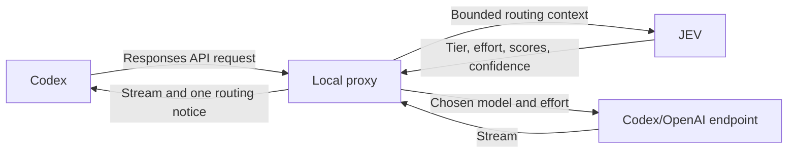

# Coding Router Jev

A TypeScript/Bun wrapper that routes Codex user turns through JEV. The command is `codex-jev`, separate from the original project's `jev-codex`.

## Run

Requires Bun and the installed Codex CLI (`codex`) with its usual authentication.

```sh
bun install
cp .env.example ~/.coding-router-jev.env
# Edit the file and set TYPESAFE_API_KEY, or export it in your shell.
bun run src/cli.ts
bun run src/cli.ts resume --last
bun run src/cli.ts exec "explain this repository"
```

Build a standalone local launcher:

```sh
bun run build
./dist/codex-jev
```

Or use `bun link` to install the source command locally. The source command requires Bun; the compiled launcher does not. Both still launch the separately installed Codex CLI.

Without `TYPESAFE_API_KEY`, the launcher reports that routing is disabled and starts ordinary Codex. With the key, it starts a proxy on `127.0.0.1` at an OS-assigned port, launches Codex with temporary provider settings, and stops the proxy when Codex exits. It passes `--no-daemon` to prevent another Codex session's shared daemon from reusing the wrong provider configuration. No permanent Codex configuration is edited. TypeSafe credentials are not passed to the Codex child process.

## Configuration

Precedence is process environment, then `~/.coding-router-jev.env`, then built-in defaults. Bun may also load a working-directory `.env` into the process environment. All example values are commented out, so copying the example does not override defaults.

| Variable | Default / purpose |
| --- | --- |
| `TYPESAFE_API_KEY` | Key read directly by the TypeSafe SDK |
| `TYPESAFE_BASE_URL` | Optional SDK endpoint override |
| `TYPESAFE_DEFAULT_MODEL` | Optional JEV model override; otherwise the SDK default |
| `CODING_ROUTER_FAST_MODEL_CODEX` | `chatgpt-6-luna` |
| `CODING_ROUTER_BALANCED_MODEL_CODEX` | `chatgpt-6.1-sol` |
| `CODING_ROUTER_STRONG_MODEL_CODEX` | `chatgpt-6.1-sol` |
| `CODING_ROUTER_LONG_MODEL_CODEX` | `chatgpt-6-astra` |
| `CODING_ROUTER_LONG_MODEL_ENABLE` | `false` |
| `CODING_ROUTER_MIN_CONFIDENCE` | `0.30`; valid range `0`–`1`, invalid values fall back |
| `CODING_ROUTER_SEND_RECENT_CONTEXT` | `true` |
| `CODING_ROUTER_FEEDBACK_FORMAT` | See [Feedback format](#feedback-format) below; unset uses the built-in notice |

Configured model choices take priority over catalog detection. The catalog enriches descriptions and effort capabilities. The requested `chatgpt-6*` default names resolve to `gpt-6*` when that corresponding ID appears in the Codex catalog; otherwise the configured ID is sent unchanged. Set an exact provider model ID if your account does not advertise that alias. Account model availability is ultimately enforced by the provider.

## Feedback format

The proxy inserts a `[Jev]` routing notice into each response stream. Set `CODING_ROUTER_FEEDBACK_FORMAT` to customize it. When the variable is unset, the default format is:

```
[Jev] tier: {tier}, model: {model}, effort: {effort}; decision: {decision}, confidence: {confidence}.
```

### Supported placeholders

| Placeholder | Description | Missing-value rendering |
| --- | --- | --- |
| `{tier}` | Selected tier (fast, balanced, strong, long) | Always present |
| `{model}` | Selected model ID | Always present |
| `{effort}` | Reasoning effort level | `default` |
| `{decision}` | Routing decision label (e.g. JEV, override) | Always present |
| `{confidence}` | Decision confidence (0.00–1.00) | `unavailable` |
| `{previous_model}` | Model before this routing decision (configured baseline on first turn, not an observed prior model) | Always present |
| `{cache_read}` | Cache-read tokens from last provider response | `unavailable` |
| `{cache_write}` | Cache-write tokens from last provider response | `unavailable` |
| `{jev_tokens_input}` | JEV request input tokens | `unavailable` |
| `{jev_tokens_output}` | JEV request output tokens | `unavailable` |
| `{jev_tokens}` | JEV total tokens (computed only when both input and output are reported) | `unavailable` |

Unknown placeholders are left as-is in the output. Token counts are never fabricated; only values actually reported by the SDK/API are shown. On the first turn, `{previous_model}` reflects the router's configured starting model, not an observed prior model.

**Example:**

```dotenv
CODING_ROUTER_FEEDBACK_FORMAT=[Jev] {tier} · {model} · effort:{effort} · {decision} · confidence:{confidence}
```

## Routing



The proxy offers **Coding Router Jev** in the model catalog and selects it by default. Choosing a concrete model with `--model` or the model picker bypasses JEV; choosing the router again resumes automatic routing. Existing provider authorization and account headers are forwarded. Auxiliary title/catch-up prompts and tool continuations do not trigger JEV routing.

The JEV request includes:

- The latest user message and a short routing-purpose instruction.
- Current tier, exact model, effort, and estimated context tokens (JSON input length divided by four).
- Available Fast, Balanced, Strong, and optionally Long tiers, with model descriptions and supported efforts. Balanced and Strong remain distinct tier choices even when they map to the same model.
- Optionally, excerpts from the previous user request and latest assistant reply, each capped at 1,000 characters. Raw tools, system blocks, Codex startup AGENTS.md instructions, and routing notices are excluded. Startup context alone does not trigger routing; the first actual user message does.
- Last-response model, observation time, cache read/write counts, and a two-minute same-model window of up to 20 samples. Missing counts are unknown; samples are not a guarantee of future cache hits. Tool continuations replace the observation for their turn. History is in memory and resets on restart.

The three score questions (`task_complexity`, `reasoning_required`, `tool_complexity`) use guidance adapted for conversational and coding requests. Tier guidance explains shared models, adequate capability, and exact-model cache observations; Long is reserved for requirements beyond the other candidates rather than session duration. A separate `reasoning_effort` choice is added, using the capabilities from the Codex catalog. If those are unavailable, known GPT-6 models use the conservative Low/Medium/High set; unknown models preserve their original effort. Scores are recorded for diagnostics and future policy changes; the current policy uses choice confidence rather than score cutoffs.

### Local policy

- Explicit leading requests such as “use Fast” or “switch to Strong” override the JEV tier choice.
- Invalid choices, failed JEV requests, and malformed confidence retain the current tier. JEV has a three-second deadline.
- Below the configured confidence threshold, downgrades are refused and upgrades above Balanced are capped at Balanced (or retained if unavailable).
- There is **no local cache downgrade guard**. JEV receives the observations to weigh cache reuse.
- Unsupported or low-confidence effort choices keep a compatible current effort or use the model's default.
- Tool continuations and duplicate requests reuse the selected tier and effort. The proxy adds `[Jev] tier: TIER, model: MODEL, effort: EFFORT; decision: REASON, confidence: VALUE.` to the response stream as assistant commentary; concurrent requests for a turn produce one decision and one notice.

### Reasoning effort and cache reuse

For a supported GPT-6 model, changes to effort use `configuration_update` input items while keeping request-level `reasoning.effort` unchanged. When Codex sends full history, the proxy replays updates at their original positions; with `previous_response_id`, provider-held history retains them. This preserves the earlier request prefix, but does not guarantee a cache hit.

Configuration updates cannot be combined with automatic compaction or automatic truncation. In those cases, and for other model families, the proxy changes request-level effort instead and records that prefix preservation was not used. Standalone `/responses/compact` requests are forwarded without injected updates. After compacted history replaces earlier anchors, effort state is reset for the new prefix. See the [OpenAI reasoning guide](https://developers.openai.com/api/docs/guides/reasoning#change-reasoning-mid-conversation).

## Routing history

Each JEV exchange appends one JSON line to a session-specific file under `${TMPDIR:-/tmp}/coding-router-jev/codex-<process-id>-<uuid>.jsonl`. The directory has mode `700`; files have mode `600`. Each record includes the routing ID, time, conversation/turn IDs, prompt, JEV request/response or error, previous selection, final decision, and cache observations. Credentials and HTTP authorization headers are not logged. Provider retries reuse the decision rather than appending another JEV exchange.

```sh
tail -f /tmp/coding-router-jev/codex-<session>.jsonl
```

Logs contain prompt text. They grow by appending, and normal OS temporary-file cleanup may remove them. Automatic log rotation is not implemented.

## Verification

```sh
bun run check
bun test
bun run build
```

Tests use local fake JEV/provider endpoints to cover routing, SDK configuration, stream fragmentation, tool continuations, retry deduplication, effort-update replay, and private JSONL records. A live read-only Codex smoke test also passed: JEV selected Fast (`gpt-6-luna`) at Low effort, Codex returned the requested `hi`, and the JSONL exchange was recorded. Multi-turn effort changes and interactive notification behavior have been verified locally, but not yet in a live interactive session.

## Attribution

JEV question instructions and tier guidance are adapted from [jev-router](https://github.com/gargpratyush/jev-router), copyright 2026 Jev Router contributors, under the included MIT license.
