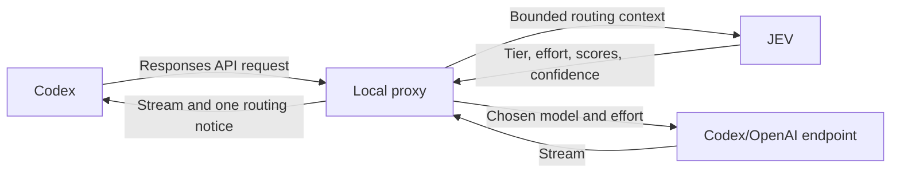

# Coding Router Jev

A TypeScript/Bun project that routes coding-agent user turns through JEV (the TypeSafe classifier). The `codex-jev` command wraps the Codex CLI; the `claude-jev` command wraps the Claude Code CLI; the Pi extension registers a `jev/auto` virtual model so Pi selects physical models and thinking levels automatically.

## Quick start

Install your coding agent first and authenticate it normally. The release binaries do not require Bun.

**1. Install**

macOS / Linux:

```sh
curl -fsSL https://raw.githubusercontent.com/guanghuang/coding-router-jev/main/install.sh | sh
```

Windows PowerShell:

```powershell
irm https://raw.githubusercontent.com/guanghuang/coding-router-jev/main/install.ps1 | iex
```

If macOS/Linux cannot find the installed commands, add `~/.local/bin` to your `PATH`:

```sh
export PATH="$HOME/.local/bin:$PATH"
```

**2. Configure JEV**

Set both TypeSafe values in your environment or `~/.coding-router-jev.env` before launching the router. On Windows, the config file is `%USERPROFILE%\.coding-router-jev.env`. To set them in your environment instead, use the commands for your shell:

```sh
export TYPESAFE_API_KEY="your-typesafe-api-key"
export TYPESAFE_BASE_URL="https://openrouter.ai/api"
```

In Windows PowerShell:

```powershell
$env:TYPESAFE_API_KEY = "your-typesafe-api-key"
$env:TYPESAFE_BASE_URL = "https://openrouter.ai/api"
```

Replace `your-typesafe-api-key` with your API key. `https://openrouter.ai/api` is the JEV classifier endpoint; it is separate from your coding agent's model provider URL. No other router settings are required; model mappings and routing behavior have defaults.

**3. Launch**

```sh
codex-jev
# Or, for Claude Code:
claude-jev
```

For Pi, install the [Pi package](#install-as-a-pi-package), set these same environment variables in the shell, and launch `pi --model jev/auto`.

The public installer requires a public repository and a published binary release. For an unreleased checkout, use [source installation](#install-from-source-bun-required).

## Prerequisites

**Codex** — The `codex-jev` launcher requires the Codex CLI (`codex`) installed separately with its usual authentication. The router does not bundle or install Codex.

**Claude Code** — The `claude-jev` launcher requires the Claude Code CLI (`claude`) installed and authenticated separately through a supported direct Anthropic login or native Claude authentication. The router does not bundle or install Claude Code. See [Claude prerequisites](#claude-prerequisites) for details.

**Pi** — The Pi extension requires `@earendil-works/pi-coding-agent` ≥ 1.0.2 and `@earendil-works/pi-ai` (declared as optional peer dependencies). Pi manages these packages; you do not install them manually. Node ≥ 22.19.0 is required by the Node package; Pi distributions that supply their own runtime do not require a separate Node installation.

## Public release checklist (maintainers)

Before changing repository visibility:

- Scan the complete Git history for credentials and private data, not just the current files. Rotate any exposed credentials before publishing; deleting a file does not remove its history.
- Review issues, pull requests, Actions logs/artifacts, and release assets for confidential content. These may become publicly accessible along with the code.
- Keep `.env` files and session JSONL logs out of commits and bug reports. Retain the included MIT license and upstream attribution.
- Commit the intended release changes, let CI pass, and publish a version tag matching `package.json` (currently `v0.1.0`). The release workflow builds binaries and checksums on `v*` tag pushes; a manual workflow run only builds artifacts.
- Once the repository and release are public, test both installer commands without `GH_TOKEN` and verify the Pi package installation from the release tag.

`"private": true` in `package.json` can stay: GitHub visibility and binary releases do not require npm publication.

## Distribution

The repository's `package.json` sets `"private": true`. This prevents accidental `npm publish` but has no effect on GitHub binary releases. The distributed binaries are standalone executables built with `bun build --compile`; npm is not part of this rollout. Each release includes binaries for `codex-jev`, `claude-jev`, and `jev-logs` for all supported platforms.

Public downloads do not require GitHub credentials.

## Install from release (recommended)

Download a prebuilt standalone binary from [GitHub Releases](https://github.com/guanghuang/coding-router-jev/releases). No Bun installation required.

### One-command installer (macOS/Linux)

The `install.sh` script detects your OS and architecture, downloads the correct binaries for `codex-jev`, `claude-jev`, and `jev-logs`, verifies their SHA-256 checksums, and places them in `~/.local/bin`. No sudo required.

```sh
curl -fsSL https://raw.githubusercontent.com/guanghuang/coding-router-jev/main/install.sh | sh
```

Prefer [download and review](#download-and-review-before-executing-macoslinux) or pin a release tag instead of piping `main` blindly.

#### Download and review before executing (macOS/Linux)

```sh
curl -fsSL https://raw.githubusercontent.com/guanghuang/coding-router-jev/main/install.sh -o install.sh
less install.sh      # review the script
sh install.sh        # run after review
```

#### Installer flags (macOS/Linux)

| Flag | Environment variable | Description |
|------|---------------------|-------------|
| `--version VERSION` | `CODEX_JEV_VERSION` | Pin a specific release tag (e.g. `v0.1.0`) |
| `--dir DIRECTORY` | `INSTALL_DIR` | Override install directory (default: `~/.local/bin`). Use an absolute path; `~` is not expanded. |
| `--help` | — | Show usage |

**Version pinning and rollback:**

```sh
# Install a specific version
sh install.sh --version v0.1.0

# Rollback to an older version
sh install.sh --version v0.0.9
```

**Custom install directory:**

```sh
sh install.sh --dir /opt/bin
```

**Uninstall (macOS/Linux):**

```sh
rm ~/.local/bin/codex-jev ~/.local/bin/claude-jev ~/.local/bin/jev-logs
# or your custom --dir path
# ~/.coding-router-jev.env is yours to keep or remove
```

The installer never modifies `~/.coding-router-jev.env` or shell startup files. When the install directory is not in your `PATH`, the script prints the export command to add. Repeating the install upgrades the binaries without accumulating `PATH` entries.

#### Upgrade and configuration preservation (macOS/Linux)

Re-running `install.sh` (with or without `--version`) replaces only the `codex-jev`, `claude-jev`, and `jev-logs` binaries. Your configuration file (`~/.coding-router-jev.env`) and any shell startup changes you made are never touched. To upgrade to the latest release, run the same installer command you used originally. To pin or roll back, pass `--version`.

### One-command installer (Windows)

The `install.ps1` PowerShell script downloads the Windows x64 binaries for `codex-jev`, `claude-jev`, and `jev-logs`, verifies their SHA-256 checksums, and installs them to `$env:LOCALAPPDATA\coding-router-jev\bin`. No administrator privileges required.

```powershell
irm https://raw.githubusercontent.com/guanghuang/coding-router-jev/main/install.ps1 | iex
```

Prefer [download and review](#download-and-review-before-executing-windows) when you want to inspect the script first.

#### Download and review before executing (Windows)

```powershell
irm https://raw.githubusercontent.com/guanghuang/coding-router-jev/main/install.ps1 -OutFile install.ps1
Get-Content install.ps1   # review the script
.\install.ps1              # run after review
```

#### Installer flags (Windows)

| Flag | Environment variable | Description |
|------|---------------------|-------------|
| `-Version VERSION` | `CODEX_JEV_VERSION` | Pin a specific release tag (e.g. `v0.1.0`) |
| `-Dir DIRECTORY` | `INSTALL_DIR` | Override install directory (default: `$env:LOCALAPPDATA\coding-router-jev\bin`) |
| `-Help` | — | Show usage |

**Version pinning and rollback:**

```powershell
# Install a specific version
.\install.ps1 -Version v0.1.0

# Rollback to an older version
.\install.ps1 -Version v0.0.9
```

**Custom install directory:**

```powershell
.\install.ps1 -Dir C:\tools\bin
```

**Uninstall (Windows):**

```powershell
Remove-Item "$env:LOCALAPPDATA\coding-router-jev\bin\codex-jev.exe"
Remove-Item "$env:LOCALAPPDATA\coding-router-jev\bin\claude-jev.exe"
Remove-Item "$env:LOCALAPPDATA\coding-router-jev\bin\jev-logs.exe"
# %USERPROFILE%\.coding-router-jev.env is yours to keep or remove
```

The installer adds the install directory to the user `PATH` (not the system `PATH`) without administrator privileges and without duplicate entries. The binaries are available in the current session immediately; open a new terminal for other shells to pick it up. The installer never modifies `~/.coding-router-jev.env`. If a running `codex-jev.exe` or `claude-jev.exe` locks the existing binary, the installer reports an actionable error.

#### Upgrade and configuration preservation (Windows)

Re-running `install.ps1` (with or without `-Version`) replaces only `codex-jev.exe`, `claude-jev.exe`, and `jev-logs.exe`. Your configuration file (`~/.coding-router-jev.env`, which on Windows resolves to `%USERPROFILE%\.coding-router-jev.env`) and user `PATH` entries are preserved. If an existing binary is locked by a running process, the installer will report an error — close the process first, then retry.

> **Note:** The binary is unsigned. Windows SmartScreen may display a "Windows protected your PC" dialog on first run. Click **More info → Run anyway**. This is expected for unsigned executables distributed outside the Windows Store. The installer itself runs within PowerShell and does not trigger SmartScreen.

### Manual download

Download assets directly from the release page, or use the GitHub CLI below.

```sh
# Download the latest release (requires gh CLI and repository access)
gh release download --repo guanghuang/coding-router-jev --pattern 'codex-jev-linux-x64'
chmod +x codex-jev-linux-x64
mv codex-jev-linux-x64 ~/.local/bin/codex-jev
```

Verify the download checksum (the downloaded binary and `SHA256SUMS` must be in the same directory):

```sh
gh release download --repo guanghuang/coding-router-jev --pattern 'SHA256SUMS'
sha256sum --check SHA256SUMS    # on macOS: shasum -a 256 --check SHA256SUMS
# Only the files present in the directory are checked; missing files cause an error.
```

### Platform support

| Binary | OS | Architecture | Notes |
|--------|----|-------------|-------|
| `codex-jev-darwin-arm64` | macOS | Apple Silicon | Unsigned |
| `codex-jev-darwin-x64` | macOS | Intel | Unsigned |
| `codex-jev-linux-arm64` | Linux | ARM64 | glibc required |
| `codex-jev-linux-x64` | Linux | x64 | glibc, SSE4.2 minimum |
| `codex-jev-windows-x64.exe` | Windows | x64 | Unsigned |
| `claude-jev-darwin-arm64` | macOS | Apple Silicon | Unsigned |
| `claude-jev-darwin-x64` | macOS | Intel | Unsigned |
| `claude-jev-linux-arm64` | Linux | ARM64 | glibc required |
| `claude-jev-linux-x64` | Linux | x64 | glibc, SSE4.2 minimum |
| `claude-jev-windows-x64.exe` | Windows | x64 | Unsigned |
| `jev-logs-darwin-arm64` | macOS | Apple Silicon | Unsigned |
| `jev-logs-darwin-x64` | macOS | Intel | Unsigned |
| `jev-logs-linux-arm64` | Linux | ARM64 | glibc required |
| `jev-logs-linux-x64` | Linux | x64 | glibc, SSE4.2 minimum |
| `jev-logs-windows-x64.exe` | Windows | x64 | Unsigned |

Alpine/musl Linux and Windows ARM64 are not supported. Binaries are unsigned; macOS Gatekeeper may require `xattr -d com.apple.quarantine codex-jev-darwin-*` after download.

**Unsigned binary details by platform:**

- **macOS**: Gatekeeper blocks unsigned binaries by default. After downloading, run `xattr -d com.apple.quarantine codex-jev-darwin-*` to remove the quarantine attribute. Alternatively, right-click the binary in Finder and choose **Open** to add a one-time exception.
- **Windows**: SmartScreen displays a warning on first run. Click **More info → Run anyway**. The `install.ps1` installer does not trigger SmartScreen because it runs within PowerShell.
- **Linux**: No code-signing enforcement. glibc is required; the installer detects musl/Alpine and exits with a clear error.

**Expected platform targets** (installers do not enforce OS version checks; unsupported combinations may fail at runtime):

| Platform | Target | Notes |
| --- | --- | --- |
| macOS (ARM64) | Apple Silicon | Prefer `codex-jev-darwin-arm64` |
| macOS (x64) | Intel Macs; Apple Silicon via Rosetta 2 | Use `codex-jev-darwin-x64` only when you need the Intel build |
| Linux (x64) | glibc Linux, SSE4.2 | Release workflow smoke-tests the x64 binary on `ubuntu-latest` |
| Linux (ARM64) | glibc Linux | Cross-compiled in CI; not yet run on ARM64 hardware |
| Windows (x64) | Windows 10+ x64 | Native x64 only; ARM64 not supported |

## Install as a Pi package

Pi manages extensions and packages natively. Installing this repository as a Pi package registers the `jev/auto` virtual model and delivers the Pi-specific `jev-logs` skill. No `bun link` is required.

### From Git

Install from a released tag:

```sh
pi install git:github.com/guanghuang/coding-router-jev@v0.1.0
```

Replace `v0.1.0` with the desired release tag. Omitting the tag tracks the default branch, which may introduce unexpected changes on reinstall — prefer pinning a tag for reproducible installs.

### Local development

For **local development**, install from an absolute path to your checkout:

```sh
# macOS / Linux
pi install /absolute/path/to/coding-router-jev

# Windows PowerShell — use a valid Windows path
pi install C:\Users\you\coding-router-jev
```

Local dependencies must be installed with the repository's supported development workflow (`bun install`) before the local Pi install.

### Select the virtual model

After installation, select `jev/auto` to enable automatic JEV routing:

```sh
pi --model jev/auto
```

### What gets installed

| Resource | Path | Description |
| --- | --- | --- |
| Extension | `./src/pi-extension.ts` | Registers `jev/auto` virtual model with Pi |
| Skill | `./skills/pi/jev-logs` | Pi-specific `jev-logs` session log query skill |

The extension and skill are visible only when this package is enabled in Pi. The Codex `jev-logs` skill (`skills/jev-logs/SKILL.md`) is not installed globally by Pi; it is managed by the Codex launcher's own skill-install mechanism.

### Pi provider login

Pi authenticates against the model provider separately from the TypeSafe classifier key:

1. **Provider login** — run `pi provider login openai-codex` to authenticate with your OpenAI Codex subscription. This grants Pi access to the inference models (`gpt-6-luna`, `gpt-6.1-sol`, etc.).
2. **TypeSafe API key** — set `TYPESAFE_API_KEY` in your environment or `~/.coding-router-jev.env`. This key is read directly by the TypeSafe SDK for JEV classification requests. It is not passed to Pi or the provider.

Both credentials are required for full Pi routing. Without the provider credential, model requests fail at the provider. Without the TypeSafe key, JEV classification is unavailable and the adapter falls back to the current or startup model without reclassifying.

Supported catalog models and provider names must match those verified against Pi 1.0.2. Use `pi model list` to see available models after provider login.

### Disable or remove

To disable JEV routing without uninstalling, select a physical model directly:

```sh
pi --model openai-codex/gpt-6.1-sol
```

To remove the package entirely:

```sh
pi remove coding-router-jev
```

The Codex `codex-jev` launcher and its installation remain functional regardless of Pi package state.

## Run (release install)

After installing a release binary, use `codex-jev` like the Codex CLI:

```sh
codex-jev --help
codex-jev exec "explain this repository"
codex-jev resume --last
```

Use `claude-jev` like the Claude Code CLI:

```sh
claude-jev --help
claude-jev --print "explain this repository"
```

Configure routing via `~/.coding-router-jev.env` (see [Configuration](#configuration)). `--help` and `--version` reflect the underlying CLI for each launcher.

## Claude prerequisites

### Claude Code CLI

The `claude-jev` launcher requires the Claude Code CLI (`claude`) installed and authenticated. Install Claude Code from [code.claude.com](https://code.claude.com) or via npm:

```sh
npm install -g @anthropic-ai/claude-code
```

Authenticate using a supported method:
- **Direct Anthropic login** — run `claude` and follow the interactive authentication flow. This authenticates with Anthropic directly using your Anthropic account.
- **API key** — set `ANTHROPIC_API_KEY` in your environment for API-key based access.

The `claude-jev` launcher does **not** authenticate with Anthropic on your behalf. It uses the existing Claude Code authentication to forward requests. The `TYPESAFE_API_KEY` is a separate credential for JEV classification only and is never sent to Anthropic.

### How claude-jev works

Without `TYPESAFE_API_KEY`, the launcher reports that routing is disabled and starts ordinary Claude Code. With the key, it starts a local proxy on `127.0.0.1` at an OS-assigned port, captures the original `ANTHROPIC_BASE_URL` as its upstream (defaulting to `https://api.anthropic.com`), sets `ANTHROPIC_BASE_URL` only in the child process to route traffic through the proxy, and launches Claude Code with temporary provider settings. The proxy intercepts Messages API requests, classifies each new user turn through JEV, selects a model/tier/effort, and forwards the request to that captured upstream. Keep your existing custom server URL and credentials; no separate upstream URL setting is needed.

Key behaviors:
- **Default routing model**: With JEV enabled, the launcher selects its routing model even if `ANTHROPIC_MODEL` is set. Configure tier models with `CODING_ROUTER_*_MODEL_CLAUDE`. An explicit `--model` argument still bypasses routing. Without JEV enabled, the original Claude model configuration is preserved.
- **Routing feedback and status line**: Each routed user intent adds a formatted `[Jev]` decision notice to the assistant response text using `CODING_ROUTER_FEEDBACK_FORMAT`, for streaming and JSON responses. Feedback is removed from forwarded history, and continuations/retries do not repeat it. Codex, Claude, and Pi use `CODING_ROUTER_STATUS_FORMAT` for status display (default `[Jev] {model} · {effort}`); Claude/Pi status is off by default and enabled with `CODING_ROUTER_STATUS_SHOW=true`. Codex substitutes `Coding Router Jev` for `{model}` and adds its selected effort natively. Codex always shows its router model label: `CODING_ROUTER_STATUS_SHOW` does not affect Codex because that label is shared with its model picker. Response notices can be hidden independently with `CODING_ROUTER_FEEDBACK_SHOW=false`. Codex adds feedback to the assistant response text. Claude status uses a temporary file and does not change global settings; existing user/project status lines and explicit `--settings` arguments are preserved. The Claude status line requires a shell with `cat` (Git Bash on Windows) and is not displayed in `--print` mode. Status formats use `{model}` and `{effort}`; feedback-only placeholders are separate.
- **Session-local plugin**: The launcher generates a temporary Claude plugin directory with the `jev-logs` skill and passes it via `--plugin-dir`. The plugin is scoped to the current session and is not installed globally. Use `/claude-jev:jev-logs` to query routing decisions.
- **Opt-out**: Set `CODING_ROUTER_JEV_LOGS_SKILL_INSTALL=false` to disable the jev-logs plugin.
- **No unsupported transports**: Bedrock and Vertex AI base URLs are rejected with an explicit error. Use the native Claude CLI directly for those providers.

### Claude model configuration

| Variable | Default |
| --- | --- |
| `CODING_ROUTER_FAST_MODEL_CLAUDE` | `claude-haiku-4-5-20251001` |
| `CODING_ROUTER_BALANCED_MODEL_CLAUDE` | `claude-sonnet-5-5` |
| `CODING_ROUTER_STRONG_MODEL_CLAUDE` | `claude-opus-5-5` |
| `CODING_ROUTER_LONG_MODEL_CLAUDE` | `claude-fable-5-1` |
| `CODING_ROUTER_CONTEXT_WINDOW_CLAUDE` | Unset (uses model physical capacity) |

Defaults map Fast to Haiku 4.5, Balanced to Sonnet 5.5, Strong to Opus 5.5, and optional Long to Fable 5.1. IDs are listed in [Anthropic’s official SDK](https://github.com/anthropics/anthropic-sdk-python/blob/main/src/anthropic/types/model.py). Model access depends on your account or custom server; Long remains disabled unless enabled. `_MODEL_CLAUDE` variables accept exact Anthropic model IDs. The router looks up each model in its known-model table for context window, output budget, and thinking mode. Unknown model IDs are used as-is but without capacity enforcement or effort normalization.

Set `CODING_ROUTER_CONTEXT_WINDOW_CLAUDE` to a positive integer to override the virtual context window for all Claude candidates. The override cannot exceed a model's physical capacity — it is clamped to `min(override, physical)`.

### Claude thinking and effort

Claude models support different thinking modes:

| Model | Thinking mode | Supported efforts |
| --- | --- | --- |
| `claude-haiku-4-5-*` | Budgeted | None (budget-only) |
| `claude-sonnet-4-*`, `claude-sonnet-4-5-*` | Adaptive | low, medium, high |
| `claude-sonnet-5-5`, `claude-opus-5-5` | Adaptive | low, medium, high, xhigh, max |
| `claude-fable-5-1` | Adaptive | low, medium, high, xhigh, max |

For adaptive-thinking models, JEV selects an effort level and the proxy sets `output_config.effort` on the request. The effort is normalized: if JEV selects an effort higher than the model supports, the highest supported level is used. If JEV confidence is below the threshold, the current effort or model default is kept.

Budgeted-thinking models (Haiku) do not support adaptive effort. The proxy strips any incompatible `output_config.effort` fields for these models.

### Claude session lifecycle

- **Routing state is in-memory**: tier, model, effort, and cache observations reset on process restart.
- **Resume and /clear**: `claude-jev` forwards all Claude Code arguments. Resume and clear are Claude Code features; the router does not manage sessions.
- **Concurrent launches**: Each `claude-jev` process starts its own proxy on a unique port. Multiple concurrent sessions do not share routing state.

### Claude unsupported modes

- **Bedrock / Vertex AI**: Setting `ANTHROPIC_BASE_URL` to an AWS Bedrock or Google Vertex endpoint causes `claude-jev` to exit with an error. Use the native Claude CLI for these transports.
- **Cloud transport**: The proxy routes through the direct Anthropic Messages API only. Other transport modes are not supported.

### Reverting to ordinary Claude

Running `claude` directly (without `claude-jev`) returns to normal Claude Code behavior. No global settings, skills, or paid-provider switches need to be undone. The session-local plugin directory is cleaned up when `claude-jev` exits.

## Install from source (Bun required)

Running from source requires [Bun](https://bun.sh/).

```sh
git clone https://github.com/guanghuang/coding-router-jev.git
cd coding-router-jev
bun install
```

Create the environment file without overwriting an existing one:

```sh
cp -n .env.example ~/.coding-router-jev.env   # GNU/Linux; on systems without cp -n, copy only if the file does not exist
chmod 600 ~/.coding-router-jev.env
# Edit ~/.coding-router-jev.env and set TYPESAFE_API_KEY, or export it in your shell.
```

Register the `codex-jev` command globally via `bun link`:

```sh
bun link
```

Verify the command is available on your PATH:

```sh
which codex-jev        # should print the bun-linked path
codex-jev --help       # forwards to codex --help
```

If `which codex-jev` prints nothing, add the Bun global bin directory to your PATH:

```sh
export PATH="$HOME/.bun/bin:$PATH"
```

Run directly from the repository without linking:

```sh
bun run src/cli.ts
bun run src/cli.ts resume --last
bun run src/cli.ts exec "explain this repository"
```

## Compiled launcher (Bun not required at runtime)

For prebuilt binaries, see [Install from release](#install-from-release-recommended). To build locally:

```sh
bun run build
./dist/codex-jev
./dist/claude-jev
./dist/jev-logs /path/to/session.jsonl --last 3
```

The compiled launchers still require the separately installed and authenticated Codex CLI or Claude Code CLI respectively.

> **Note:** `codex-jev` forwards all arguments to Codex, so `--version` and `--help` identify the Codex CLI. Similarly, `claude-jev` forwards arguments to Claude Code.

## How it works

### Codex

Without `TYPESAFE_API_KEY`, the launcher reports that routing is disabled and starts ordinary Codex. With the key, it starts a proxy on `127.0.0.1` at an OS-assigned port, launches Codex with temporary provider settings, and stops the proxy when Codex exits. It passes `--no-daemon` to prevent another Codex session's shared daemon from reusing the wrong provider configuration. No permanent Codex configuration is edited. TypeSafe credentials are not passed to the Codex child process.

### Pi

The Pi extension (`src/pi-extension.ts`) registers a `jev/auto` virtual model with Pi's coding agent. When a user selects `jev/auto`, Pi delegates model resolution to the adapter, which calls the TypeSafe JEV classifier and returns a physical provider/model pair with a thinking level. Pi then uses that physical model for inference. The adapter runs in-process within Pi — no separate proxy or child process is involved.

## Configuration

Precedence is process environment, then `~/.coding-router-jev.env`, then built-in defaults. Bun may also load a working-directory `.env` into the process environment. All example values in `.env.example` are commented out, so copying the example does not override defaults.

On **Windows**, `~` resolves to `%USERPROFILE%` (typically `C:\Users\<name>`), so the configuration file is `%USERPROFILE%\.coding-router-jev.env`. On **macOS and Linux**, it is `$HOME/.coding-router-jev.env`. The file format is the same on all platforms.

| Variable | Default / purpose |
| --- | --- |
| `TYPESAFE_API_KEY` | Key read directly by the TypeSafe SDK |
| `TYPESAFE_BASE_URL` | Optional SDK endpoint override |
| `TYPESAFE_DEFAULT_MODEL` | Optional JEV model override; otherwise the SDK default |
| `CODING_ROUTER_FAST_MODEL_CODEX` | `chatgpt-6-luna` |
| `CODING_ROUTER_BALANCED_MODEL_CODEX` | `chatgpt-6.1-sol` |
| `CODING_ROUTER_STRONG_MODEL_CODEX` | `chatgpt-6.1-sol` |
| `CODING_ROUTER_LONG_MODEL_CODEX` | `chatgpt-6-astra` |
| `CODING_ROUTER_LONG_MODEL_ENABLE` | `false` |
| `CODING_ROUTER_START_TIER` | `fast`; initial tier for new conversations and after restart. Allowed: `fast`, `balanced`, `strong`, `long`. Invalid or blank defaults to `fast`. `long` with Long disabled falls back to `fast`. The configured model alias for the chosen tier determines the actual startup model. |
| `CODING_ROUTER_MIN_CONFIDENCE` | `0.30`; valid range `0`–`1`, invalid values fall back |
| `CODING_ROUTER_SEND_RECENT_CONTEXT` | `true` |
| `CODING_ROUTER_FEEDBACK_FORMAT` | Response feedback format; unset uses the detailed built-in notice |
| `CODING_ROUTER_STATUS_FORMAT` | Status format for Codex/Claude/Pi; unset uses `[Jev] {model} · {effort}` |
| `CODING_ROUTER_STATUS_SHOW` | Show Claude/Pi status lines; default `false`. Codex always shows its router label |
| `CODING_ROUTER_FEEDBACK_SHOW` | Show response feedback across agents; default `true` |
| `CODING_ROUTER_LOG_RETENTION_DAYS` | Unset (no cleanup); positive number enables startup deletion of stale session logs older than this many days |
| `CODING_ROUTER_JEV_LOGS_SKILL_INSTALL` | `true`; set to `false` to skip automatic `jev-logs` skill installation |

Configured model choices take priority over catalog detection. The catalog enriches descriptions and effort capabilities. The requested `chatgpt-6*` default names resolve to `gpt-6*` when that corresponding ID appears in the Codex catalog; otherwise the configured ID is sent unchanged. Set an exact provider model ID if your account does not advertise that alias. Account model availability is ultimately enforced by the provider.

### Pi agent configuration

The shared routing configuration includes model mappings for Pi extensions. Pi uses provider-qualified model IDs (e.g. `openai-codex/gpt-6-luna`) where the first slash separates the provider prefix from the model name; model IDs may themselves contain additional slashes.

| Variable | Default |
| --- | --- |
| `CODING_ROUTER_FAST_MODEL_PI` | `openai-codex/gpt-6-luna` |
| `CODING_ROUTER_BALANCED_MODEL_PI` | `openai-codex/gpt-6.1-sol` |
| `CODING_ROUTER_STRONG_MODEL_PI` | `openai-codex/gpt-6.1-sol` |
| `CODING_ROUTER_LONG_MODEL_PI` | `openai-codex/gpt-6-astra` |

Shared settings — confidence threshold, recent context, feedback format, log retention, Long model enable — apply to Codex, Claude, and Pi. Each adapter consumes these mappings through `configFromEnv()`. Claude model aliases (`_MODEL_CLAUDE`) are documented in [Claude model configuration](#claude-model-configuration).

#### Thinking-level normalization

Pi models support a subset of thinking levels: `off`, `minimal`, `low`, `medium`, `high`, `xhigh`, `max`. The JEV classifier selects a reasoning effort string; the Pi adapter maps it to a supported thinking level using `clampThinkingLevel(model, level)` from `@earendil-works/pi-ai`. Clamping searches upward first, then downward. Non-reasoning models support `off` only.

JEV picks Pi-supported levels and Pi maps them to provider reasoning settings. There is no blanket equivalence to Codex effort strings — Codex preserves its own effort fallback and virtual-model context behavior, while Pi uses physical-model metadata and native thinking-level clamping.

#### Startup, resume, and session lifecycle

- **Fresh start**: The adapter initializes at the configured startup tier (default Fast). JEV routes the first actual user message normally and may select a different tier.
- **Resume**: Pi's native state restore delivers the saved `AdapterState` (tier, provider, model, effective effort, version). The adapter validates the saved state against the current registry and reconciles with the physical model Pi reports as active. Invalid or unknown state versions fall back to startup defaults.
- **Fork / tree navigation**: Separate restore calls produce independent state. The adapter does not carry over state across forks.
- **Compaction**: Pi compaction replaces earlier conversation anchors. The adapter treats a compacted restore identically to a normal resume — saved state is authoritative.

#### Feedback and notices

- One routing notice per user intent, using the configurable `CODING_ROUTER_FEEDBACK_FORMAT`.
- Continuation, retry, and direct calls (sticky tool calls, retries) do not trigger feedback.
- Feedback is not stored in Pi's assistant history.

#### jev-logs skill delivery

When this package is enabled in Pi, the `jev-logs` skill (`skills/pi/jev-logs/SKILL.md`) is visible. The skill queries only the active session's JSONL log through a `jev_logs` tool registered by the extension. Ordinary Codex never acquires this skill through Pi installation — Codex has its own `jev-logs` skill managed by the Codex launcher's skill-install mechanism.

#### Advertised capacity and routing contracts

JEV evaluates candidate models for capacity eligibility based on context window metadata from the Pi registry. Advertised API capacity does not imply the client or backend uses that full capacity. The adapter handles:

- **Known-capacity rejection**: Candidates whose context window is smaller than the estimated context tokens (plus a 16K output reservation) are excluded before classification.
- **Unknown capacity**: Candidates without context window metadata are included as unknown and eligible for routing.
- **No silent truncation**: The adapter does not truncate context to fit a smaller model. If all candidates are rejected by capacity, the current model is retained with a `capacity/no-eligible` decision.

Codex preserves its existing effort fallback and virtual-model context behavior. The routing policy (tier selection, confidence thresholds, override detection) is shared between Codex and Pi; only the effort mapping and state persistence differ.

## Feedback format

Adapters show a detailed `[Jev]` routing notice in their response (see [Routing notices](#routing-notices)). Set `CODING_ROUTER_FEEDBACK_FORMAT` to customize it. When the variable is unset, the default format is:

```
[Jev] tier: {tier}, model: {model}, effort: {effort}; decision: {decision}, confidence: {confidence}.
```

### Supported placeholders

| Placeholder | Description | Missing-value rendering |
| --- | --- | --- |
| `{tier}` | Selected tier (fast, balanced, strong, long) | Always present |
| `{model}` | Selected model ID | Always present |
| `{effort}` | Reasoning effort level | `default` |
| `{decision}` | Routing decision label (e.g. JEV, override) | Always present |
| `{confidence}` | Decision confidence (0.00–1.00) | `unavailable` |
| `{previous_model}` | Model before this routing decision (configured baseline on first turn, not an observed prior model) | Always present |
| `{cache_read}` | Cache-read tokens from last provider response | `unavailable` |
| `{cache_write}` | Cache-write tokens from last provider response | `unavailable` |
| `{jev_tokens_input}` | JEV request input tokens | `unavailable` |
| `{jev_tokens_output}` | JEV request output tokens | `unavailable` |
| `{jev_tokens}` | JEV total tokens (computed only when both input and output are reported) | `unavailable` |

Unknown placeholders are left as-is in the output. Token counts are never fabricated; only values actually reported by the SDK/API are shown. On the first turn, `{previous_model}` reflects the router's configured starting model, not an observed prior model.

**Example:**

```dotenv
CODING_ROUTER_FEEDBACK_FORMAT=[Jev] tier: {tier}, model: {model}, effort: {effort}; decision: {decision}, confidence: {confidence}.
CODING_ROUTER_STATUS_FORMAT=[Jev] {model} · {effort}
```

## Routing



The proxy offers **Coding Router Jev** in the model catalog and selects it by default. Choosing a concrete model with `--model` or the model picker bypasses JEV; choosing the router again resumes automatic routing. Existing provider authorization and account headers are forwarded. Auxiliary title/catch-up prompts and tool continuations do not trigger JEV routing.

The proxy initializes each new in-memory conversation state at the configured startup tier (default **Fast**; set `CODING_ROUTER_START_TIER` to change). The startup tier is a baseline: JEV still routes the first actual user message normally and may select a different tier. In-memory routing state resets when the process restarts to the configured startup tier, so tier observations and cache tracking from the previous session are lost. Restart does not recover the previous router model, effort-update history, or cache observations; prior user/assistant excerpts can still be sent when present in Codex's incoming history and recent-context is enabled.

The JEV request includes:

- The latest user message and a short routing-purpose instruction.
- Current tier, exact model, effort, and estimated context tokens (JSON input length divided by four).
- Available Fast, Balanced, Strong, and optionally Long tiers, with model descriptions and supported efforts. Balanced and Strong remain distinct tier choices even when they map to the same model.
- Optionally, excerpts from the previous user request and latest assistant reply, each capped at 1,000 characters. Raw tools, system blocks, Codex startup AGENTS.md instructions, and routing notices are excluded. Startup context alone does not trigger routing; the first actual user message does.
- Last-response model, observation time, cache read/write counts, and a two-minute same-model window of up to 20 samples. Missing counts are unknown; samples are not a guarantee of future cache hits. Tool continuations replace the observation for their turn. History is in memory and resets on restart.

The three score questions (`task_complexity`, `reasoning_required`, `tool_complexity`) use guidance adapted for conversational and coding requests. Tier guidance explains shared models, adequate capability, and exact-model cache observations; Long is reserved for requirements beyond the other candidates rather than session duration. A separate `reasoning_effort` choice is added, using the capabilities from the Codex catalog. If those are unavailable, known GPT-6 models use the conservative Low/Medium/High set; unknown models preserve their original effort. Scores are recorded for diagnostics and future policy changes; the current policy uses choice confidence rather than score cutoffs.

### Local policy

- Explicit leading requests such as "use Fast" or "switch to Strong" override the JEV tier choice.
- Invalid choices, failed JEV requests, and malformed confidence retain the current tier. JEV has a three-second deadline.
- Below the configured confidence threshold, downgrades are refused and upgrades are capped at the higher of the current tier and Balanced (or retained if that tier is unavailable). For example, from Fast the ceiling is Balanced; from Strong the ceiling stays Strong.
- There is **no local cache downgrade guard**. JEV receives the observations to weigh cache reuse.
- Unsupported or low-confidence effort choices keep a compatible current effort or use the model's default.
- Tool continuations and duplicate requests reuse the selected tier and effort.

### Routing notices

Decision feedback includes the accepted tier transition: `JEV/upgrade`, `JEV/downgrade`, or `JEV/no-change`. Explicit overrides use `override/upgrade`, `override/downgrade`, or `override/no-change`. Confidence-capped outcomes retain their policy detail, such as `low-confidence/capped/upgrade` or `low-confidence/capped/no-change`. Direction follows tier order (Fast → Balanced → Strong → Long), even when tiers share a model; it does not describe an effort-only change. Existing unavailable and blocked-downgrade labels remain unchanged. JSONL decision reasons also include the transition.

The proxy adds a configurable routing notice (see [Feedback format](#feedback-format)) as assistant commentary in eligible response streams. Eligible streams are those with `Content-Type` of `text/event-stream` or `application/octet-stream`, as well as responses where the upstream `Content-Type` header is absent; in the latter case, a notice is added only when the response body contains SSE-shaped frames. Non-streaming JSON responses do not receive a notice. Concurrent requests for a turn produce one decision and one notice.

### Reasoning effort and cache reuse

For a supported GPT-6 model, changes to effort use `configuration_update` input items while keeping request-level `reasoning.effort` unchanged. When Codex sends full history, the proxy replays updates at their original positions; with `previous_response_id`, provider-held history retains them. This preserves the earlier request prefix, but does not guarantee a cache hit.

Configuration updates cannot be combined with automatic compaction or automatic truncation. In those cases, and for other model families, the proxy changes request-level effort instead and records that prefix preservation was not used. Standalone `/responses/compact` requests are forwarded without injected updates. After compacted history replaces earlier anchors, effort state is reset for the new prefix. See the [OpenAI reasoning guide](https://developers.openai.com/api/docs/guides/reasoning#change-reasoning-mid-conversation).

## Routing history

Each JEV exchange appends one JSON line to a session-specific file under `${TMPDIR:-/tmp}/coding-router-jev/jev-<session-id>.jsonl`. The directory is created with POSIX mode `700` and files with mode `600`; these permissions are not equivalent to Windows ACLs and do not provide the same guarantees on non-POSIX platforms. Each record includes the routing ID, time, conversation/turn IDs, prompt, JEV request/response or error, previous selection, final decision, and cache observations. Credentials and HTTP authorization headers are not logged. Provider retries reuse the decision rather than appending another JEV exchange.

Pi routing logs use the same directory and filename convention: `${TMPDIR:-/tmp}/coding-router-jev/jev-<pi-session-id>.jsonl`. Each user intent has one JSONL record containing the full JEV request, response, and decision. Agent response token and cache usage updates that record under `cache.agent_usage`, summing usage across tool continuations. `response.observed_responses` counts those responses. Existing observation records remain readable. Pi also supplies `session.last_response_at` and `session.last_response_seconds_ago` to JEV from the previous successful assistant message, including after resume. These are null when unknown. Idle time informs cost selection without claiming that a provider cache is valid or expired. The `jev_logs` tool queries only the active Pi session. Logs are written after the first routing decision.

```sh
tail -f "${TMPDIR:-/tmp}/coding-router-jev/jev-<session-id>.jsonl"
```

Logs contain user prompts and routing payloads (including optional recent context excerpts). Treat JSONL files as confidential; do not paste them into public issues without redaction. They grow by appending, and normal OS temporary-file cleanup may remove them. If writing a log entry fails, the router prints `[Jev] could not write routing history` to stderr and continues.

### Log retention

Set `CODING_ROUTER_LOG_RETENTION_DAYS` to a positive number in the process environment or `~/.coding-router-jev.env` to enable startup cleanup. When the launcher starts, session JSONL files in the log directory whose modification time is older than the configured number of days are deleted. New logs for Codex, Claude, and Pi use `jev-*.jsonl`. Cleanup also recognizes legacy files for the launching agent; unrelated files and directories are never touched. If the setting is missing, blank, invalid, zero, or negative, no logs are deleted. Cleanup runs once at startup; there is no background timer. If an individual stale file cannot be removed, the error is logged and the launcher continues normally.

## Active session log queries (jev-logs skill)

The `jev-logs` Codex skill lets you ask questions about the current routing session. On startup, the launcher installs the skill at `$CODEX_HOME/skills/jev-logs/SKILL.md` (default: `~/.codex/skills/jev-logs/SKILL.md`) and sets `JEV_SESSION_LOG` so queries search only the active session.

### Example queries

| User request | What happens |
| --- | --- |
| "Show the last log" | One concise routing summary |
| "Show the last 3 decisions" | Three timestamped summaries |
| "Which model was used for the last turn?" | Model and tier from the last entry |
| "Show decisions where the tier was fast" | Filtered by tier |
| "Show all routing errors today" | Filtered by date and error presence |

### Standalone CLI

The `jev-logs` binary can also be used directly:

```sh
jev-logs "$JEV_SESSION_LOG" --last 5
jev-logs "$JEV_SESSION_LOG" --filter-tier fast --last 10
jev-logs "$JEV_SESSION_LOG" --filter-model gpt-6-luna
jev-logs "$JEV_SESSION_LOG" --filter-keyword "debug" --detail
jev-logs "$JEV_SESSION_LOG" --filter-date 2026-10-04
```

Default output is a concise human-readable summary with prompt preview, tier, model, effort, decision, confidence, and usage. Use `--detail` for full prompt text and JEV latency. Raw JSON is never shown by default.

### Skill installation

| Behavior | Details |
| --- | --- |
| Install location | `$CODEX_HOME/skills/jev-logs/SKILL.md`; falls back to `~/.codex/skills/jev-logs/SKILL.md` |
| Automatic update | Updates the file when the bundled content changes; skips if the file was edited by the user (no `<!-- managed by coding-router-jev -->` header) |
| Opt-out | Set `CODING_ROUTER_JEV_LOGS_SKILL_INSTALL=false` in the environment or `~/.coding-router-jev.env` |
| Privacy | Queries only the active session; never scans other session files; never shows API keys or authorization headers |

### Compiled installation

The build script compiles `jev-logs` as a standalone binary alongside `codex-jev` and `claude-jev`. No Bun or Python required at runtime.

```sh
bun run build   # produces dist/codex-jev, dist/claude-jev, and dist/jev-logs
```

## Resume

The `resume` subcommand and its flags (e.g. `--last`, `--all`) are forwarded directly to Codex. The router does not manage sessions; session storage, filtering, and visibility are controlled by Codex. Adding `--all` removes the working-directory filter in Codex, but another provider configuration can still affect which sessions are visible. The router's in-memory routing state (tier, observations, cache tracking) is not persisted across restarts; a resumed session starts at the configured startup tier (default Fast) rather than the previous session's final tier.

## Verification

```sh
bun run check
bun test
bun run build
```

### Releasing

Bump `version` in `package.json`, then push a matching tag:

```sh
git tag v0.2.0
git push origin v0.2.0
```

The `.github/workflows/release.yml` workflow validates, cross-compiles, and publishes release assets. The tag version must match `package.json`. Trigger `workflow_dispatch` manually to test the build pipeline without publishing — the version-tag check is skipped and the release job runs only on tag push.

Tests use local fake JEV/provider endpoints to cover routing, SDK configuration, stream fragmentation, tool continuations, retry deduplication, effort-update replay, and private JSONL records. A live read-only Codex smoke test also passed: JEV selected Fast (`gpt-6-luna`) at Low effort, Codex returned the requested `hi`, and the JSONL exchange was recorded. Multi-turn effort changes and interactive notification behavior have been verified locally but not yet in a live interactive session. Other platforms and desktop routing have not been validated.

### Installer verification status

**Automated (CI / unit tests):** `install.sh` and `install.ps1` flows — download, checksum verification, version pinning, upgrade replace, auth with `GH_TOKEN`, config file preservation, and error handling — are covered by `test/install.test.ts` and `test/install-windows.test.ts`. Release workflow smoke-tests the Linux x64 binary.

**Manually verified:**

- **macOS (ARM64 and x64)**: End-to-end `install.sh`, PATH guidance, Gatekeeper quarantine removal.
- **Linux (x64)**: End-to-end `install.sh` on Ubuntu 22.04.
- **Windows (x64)**: End-to-end `install.ps1`, user PATH updates, SmartScreen on first binary run, locked-binary error when the executable is in use.

**Not yet verified:**

- Linux ARM64 on physical hardware (CI cross-compiles only).
- Interactive multi-turn routing sessions on all platforms (verified locally on macOS only).
- ChatGPT desktop or Work integration (not implemented; not advertised).
- Pi git/local installation end-to-end on macOS, Linux, and Windows (package manifest and resource discovery are validated in unit tests; platform-specific Pi runtime installation is documented but not automated in CI).

## Troubleshooting

### "codex: command not found" or "codex-jev starts but cannot find Codex"

The Codex CLI (`codex`) must be installed and authenticated separately. `codex-jev` is a routing wrapper, not a replacement for Codex. Install Codex from [github.com/openai/codex](https://github.com/openai/codex), run `codex auth`, and confirm `codex --help` works before using `codex-jev`.

### "Do I need Bun?"

**No**, if you use a prebuilt binary from [GitHub Releases](https://github.com/guanghuang/coding-router-jev/releases) or an installer (`install.sh` / `install.ps1`). Bun is only required for [source installation](#install-from-source-bun-required) or local development.

### "claude-jev: Claude Code CLI not found"

The Claude Code CLI (`claude`) must be installed and authenticated separately. `claude-jev` is a routing wrapper, not a replacement for Claude Code. Install Claude Code from [code.claude.com](https://code.claude.com) or via `npm install -g @anthropic-ai/claude-code`, authenticate, and confirm `claude --help` works before using `claude-jev`.

### "claude-jev: TYPESAFE_API_KEY is not set"

Without `TYPESAFE_API_KEY`, `claude-jev` starts ordinary Claude Code without JEV routing. Set the key in `~/.coding-router-jev.env` or your shell environment to enable routing.

### PATH collisions — wrong `codex-jev` is found

If `which codex-jev` (or `Get-Command codex-jev` on Windows) prints a different path than expected:

```sh
# macOS/Linux — check all locations
which -a codex-jev

# Windows PowerShell
Get-Command codex-jev -All
```

Ensure the installer's directory appears **before** the conflicting directory in your `PATH`. The macOS/Linux installer prints the required `export` command when the directory is not in `PATH`. The Windows installer adds the directory automatically but a new terminal may be needed.

### Unsupported architecture or OS

Installers print explicit errors such as `Alpine Linux (musl) is not supported`, `musl libc detected`, `unsupported operating system`, `unsupported architecture`, or (Windows) `Windows ARM64 is not supported`. Use a supported OS/architecture from the [platform support](#platform-support) table.

### Checksum verification failure

If `sha256sum --check SHA256SUMS` fails or the installer reports `checksum mismatch`, `no checksum found for`, or `no SHA-256 tool found`:

1. Re-download the binary and `SHA256SUMS` from the same release tag.
2. Ensure you did not mix assets from different releases.
3. If the mismatch persists, the download may have been corrupted in transit. Try a different network or download method (`gh release download` vs. direct URL).

### Release not found / unavailable

- Verify releases exist at [github.com/guanghuang/coding-router-jev/releases](https://github.com/guanghuang/coding-router-jev/releases).
- When pinning a version (`--version v0.1.0`), ensure the tag exists.
- Unix installers may report `release not found while trying to download …`; Windows may report `release asset not found: codex-jev-windows-x64.exe for …`.
- The `workflow_dispatch` trigger builds but does not publish a release; only tag pushes create releases.

### Windows install or upgrade errors

- **`cannot replace … The file may be in use`**: Close any running `codex-jev` process and retry.
- **`upgrade failed; previous installation restored`**: The new binary could not replace the old one; free the file lock and reinstall.
- **`upgrade failed and restore failed`**: Rename the `.exe.old` backup next to `codex-jev.exe` manually if needed.
- **`failed to install binary to`**: Check disk space and permissions under your install directory (`-Dir` / `$env:LOCALAPPDATA\coding-router-jev\bin` by default).

### macOS Gatekeeper blocks the binary

After downloading a prebuilt binary outside an installer:

```sh
xattr -d com.apple.quarantine codex-jev-darwin-*
```

Or right-click the binary in Finder and choose **Open** to create a one-time exception.

### Windows SmartScreen blocks the binary

SmartScreen may show "Windows protected your PC" on first run. Click **More info → Run anyway**. This is expected for unsigned executables.

### Routing history log location

Session logs are written to `${TMPDIR:-/tmp}/coding-router-jev/` on macOS/Linux. On Windows, the equivalent `%TEMP%` directory is used. Logs contain user prompts — treat them as confidential.

### Pi: "No valid Pi models configured"

The adapter could not find any configured model in Pi's registry. Check that:
1. Provider login succeeded: `pi provider login openai-codex`
2. `_MODEL_PI` environment variables (or defaults) match models available in Pi: `pi model list`
3. `TYPESAFE_API_KEY` is set for JEV classification

### Pi: "does not support virtual models"

Pi version is below 1.0.2. Virtual models were introduced as experimental in 0.99.0 and stabilized in 1.0.2. Upgrade to `@earendil-works/pi-coding-agent` ≥ 1.0.2.

### Pi: "already registered"

Another extension has already registered the `jev/auto` virtual model. Only one extension can claim a given virtual model ID. Check installed Pi packages for conflicts.

### Pi: jev-logs skill not visible

The `jev-logs` skill is delivered by this package and is visible only when the package is enabled. Run `pi package list` to confirm the package is installed and active. The Codex `jev-logs` skill is a separate file managed by the Codex launcher.

## Compatibility

| Platform | Codex (codex-jev) | Claude (claude-jev) | Pi (jev/auto) | Notes |
| --- | --- | --- | --- | --- |
| macOS (ARM64) | Binary + source | Binary + source | Git/local install | Codex tested end-to-end; Claude proxy validated in unit tests; Pi manifest validated in unit tests |
| macOS (x64) | Binary + source | Binary + source | Git/local install | Codex tested end-to-end; Claude proxy validated in unit tests; Pi manifest validated in unit tests |
| Linux (x64) | Binary + source | Binary + source | Git/local install | Codex tested on Ubuntu; Pi manifest validated in unit tests; glibc required |
| Linux (ARM64) | Binary (cross-compiled) | Binary (cross-compiled) | Git/local install | Not yet tested on ARM64 hardware |
| Windows (x64) | Binary + source | Binary + source | Git/local install | PowerShell paths; ARM64 not supported |

Pi support requires `@earendil-works/pi-coding-agent` ≥ 1.0.2. Pi runtime installation and resource discovery are documented but not automated in CI; platform-specific smoke tests should be run manually.

## Attribution

JEV question instructions and tier guidance are adapted from [jev-router](https://github.com/gargpratyush/jev-router), copyright 2026 Jev Router contributors, under the included [MIT license](./LICENSE).
