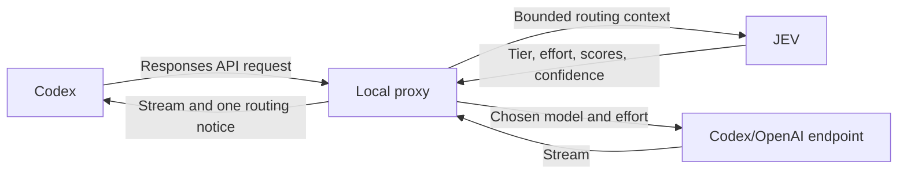

# Coding Router Jev

A TypeScript/Bun wrapper that routes Codex user turns through JEV. The command is `codex-jev`, separate from the original project's `jev-codex`.

## Prerequisites

All installation paths require the Codex CLI (`codex`) installed separately with its usual authentication. The router does not bundle or install Codex.

## Install from release (recommended)

Download a prebuilt standalone binary from [GitHub Releases](https://github.com/guanghuang/coding-router-jev/releases). No Bun installation required.

### One-command installer

The `install.sh` script detects your OS and architecture, downloads the correct binary, verifies its SHA-256 checksum, and places it in `~/.local/bin`. No sudo required.

**Public repository (once public):**

```sh
curl -fsSL https://raw.githubusercontent.com/guanghuang/coding-router-jev/main/install.sh | sh
```

**Private repository (requires authentication):**

```sh
# Option 1: Set GH_TOKEN
GH_TOKEN=ghp_your_token sh install.sh

# Option 2: Download the script first, then run locally
gh release download --repo guanghuang/coding-router-jev --pattern install.sh
sh install.sh
```

**Download and review before executing:**

```sh
curl -fsSL https://raw.githubusercontent.com/guanghuang/coding-router-jev/main/install.sh -o install.sh
less install.sh      # review the script
sh install.sh        # run after review
```

#### Installer flags

| Flag | Environment variable | Description |
|------|---------------------|-------------|
| `--version VERSION` | `CODEX_JEV_VERSION` | Pin a specific release tag (e.g. `v0.1.0`) |
| `--dir DIRECTORY` | `INSTALL_DIR` | Override install directory (default: `~/.local/bin`) |
| `--help` | — | Show usage |
| — | `GH_TOKEN` | GitHub token for private repository access |

**Version pinning and rollback:**

```sh
# Install a specific version
sh install.sh --version v0.1.0

# Rollback to an older version
sh install.sh --version v0.0.9
```

**Custom install directory:**

```sh
sh install.sh --dir /opt/bin
```

**Uninstall:**

```sh
rm ~/.local/bin/codex-jev    # or your custom --dir path
# ~/.coding-router-jev.env is yours to keep or remove
```

The installer never modifies `~/.coding-router-jev.env` or shell startup files. When the install directory is not in your `PATH`, the script prints the export command to add. Repeating the install upgrades the binary without accumulating `PATH` entries.

### Manual download

```sh
# Download the latest release (requires gh CLI and repository access)
gh release download --repo guanghuang/coding-router-jev --pattern 'codex-jev-linux-x64'
chmod +x codex-jev-linux-x64
mv codex-jev-linux-x64 ~/.local/bin/codex-jev
```

Verify the download checksum (the downloaded binary and `SHA256SUMS` must be in the same directory):

```sh
gh release download --repo guanghuang/coding-router-jev --pattern 'SHA256SUMS'
sha256sum --check SHA256SUMS    # on macOS: shasum -a 256 --check SHA256SUMS
# Only the files present in the directory are checked; missing files cause an error.
```

### Platform support

| Binary | OS | Architecture | Notes |
|--------|----|-------------|-------|
| `codex-jev-darwin-arm64` | macOS | Apple Silicon | Unsigned |
| `codex-jev-darwin-x64` | macOS | Intel | Unsigned |
| `codex-jev-linux-arm64` | Linux | ARM64 | glibc required |
| `codex-jev-linux-x64` | Linux | x64 | glibc, SSE4.2 minimum |
| `codex-jev-windows-x64.exe` | Windows | x64 | Unsigned |

Alpine/musl Linux and Windows ARM64 are not supported. Binaries are unsigned; macOS Gatekeeper may require `xattr -d com.apple.quarantine codex-jev-darwin-*` after download.

## Install from source (Bun required)

Running from source requires [Bun](https://bun.sh/).

```sh
git clone https://github.com/guanghuang/coding-router-jev.git
cd coding-router-jev
bun install
```

Create the environment file without overwriting an existing one:

```sh
cp -n .env.example ~/.coding-router-jev.env   # GNU/Linux; on systems without cp -n, copy only if the file does not exist
chmod 600 ~/.coding-router-jev.env
# Edit ~/.coding-router-jev.env and set TYPESAFE_API_KEY, or export it in your shell.
```

Register the `codex-jev` command globally via `bun link`:

```sh
bun link
```

Verify the command is available on your PATH:

```sh
which codex-jev        # should print the bun-linked path
codex-jev --help       # forwards to codex --help
```

If `which codex-jev` prints nothing, add the Bun global bin directory to your PATH:

```sh
export PATH="$HOME/.bun/bin:$PATH"
```

Run directly from the repository without linking:

```sh
bun run src/cli.ts
bun run src/cli.ts resume --last
bun run src/cli.ts exec "explain this repository"
```

## Compiled launcher (Bun not required at runtime)

For prebuilt binaries, see [Install from release](#install-from-release-recommended). To build locally:

```sh
bun run build
./dist/codex-jev
```

The compiled launcher still requires the separately installed and authenticated Codex CLI.

> **Note:** `codex-jev` forwards all arguments to Codex, so `--version` and `--help` identify the Codex CLI, not a dedicated router version.

## How it works

Without `TYPESAFE_API_KEY`, the launcher reports that routing is disabled and starts ordinary Codex. With the key, it starts a proxy on `127.0.0.1` at an OS-assigned port, launches Codex with temporary provider settings, and stops the proxy when Codex exits. It passes `--no-daemon` to prevent another Codex session's shared daemon from reusing the wrong provider configuration. No permanent Codex configuration is edited. TypeSafe credentials are not passed to the Codex child process.

## Configuration

Precedence is process environment, then `~/.coding-router-jev.env`, then built-in defaults. Bun may also load a working-directory `.env` into the process environment. All example values in `.env.example` are commented out, so copying the example does not override defaults.

| Variable | Default / purpose |
| --- | --- |
| `TYPESAFE_API_KEY` | Key read directly by the TypeSafe SDK |
| `TYPESAFE_BASE_URL` | Optional SDK endpoint override |
| `TYPESAFE_DEFAULT_MODEL` | Optional JEV model override; otherwise the SDK default |
| `CODING_ROUTER_FAST_MODEL_CODEX` | `chatgpt-6-luna` |
| `CODING_ROUTER_BALANCED_MODEL_CODEX` | `chatgpt-6.1-sol` |
| `CODING_ROUTER_STRONG_MODEL_CODEX` | `chatgpt-6.1-sol` |
| `CODING_ROUTER_LONG_MODEL_CODEX` | `chatgpt-6-astra` |
| `CODING_ROUTER_LONG_MODEL_ENABLE` | `false` |
| `CODING_ROUTER_MIN_CONFIDENCE` | `0.30`; valid range `0`–`1`, invalid values fall back |
| `CODING_ROUTER_SEND_RECENT_CONTEXT` | `true` |
| `CODING_ROUTER_FEEDBACK_FORMAT` | See [Feedback format](#feedback-format) below; unset uses the built-in notice |

Configured model choices take priority over catalog detection. The catalog enriches descriptions and effort capabilities. The requested `chatgpt-6*` default names resolve to `gpt-6*` when that corresponding ID appears in the Codex catalog; otherwise the configured ID is sent unchanged. Set an exact provider model ID if your account does not advertise that alias. Account model availability is ultimately enforced by the provider.

## Feedback format

The proxy inserts a `[Jev]` routing notice into eligible response streams (see [Routing notices](#routing-notices)). Set `CODING_ROUTER_FEEDBACK_FORMAT` to customize it. When the variable is unset, the default format is:

```
[Jev] tier: {tier}, model: {model}, effort: {effort}; decision: {decision}, confidence: {confidence}.
```

### Supported placeholders

| Placeholder | Description | Missing-value rendering |
| --- | --- | --- |
| `{tier}` | Selected tier (fast, balanced, strong, long) | Always present |
| `{model}` | Selected model ID | Always present |
| `{effort}` | Reasoning effort level | `default` |
| `{decision}` | Routing decision label (e.g. JEV, override) | Always present |
| `{confidence}` | Decision confidence (0.00–1.00) | `unavailable` |
| `{previous_model}` | Model before this routing decision (configured baseline on first turn, not an observed prior model) | Always present |
| `{cache_read}` | Cache-read tokens from last provider response | `unavailable` |
| `{cache_write}` | Cache-write tokens from last provider response | `unavailable` |
| `{jev_tokens_input}` | JEV request input tokens | `unavailable` |
| `{jev_tokens_output}` | JEV request output tokens | `unavailable` |
| `{jev_tokens}` | JEV total tokens (computed only when both input and output are reported) | `unavailable` |

Unknown placeholders are left as-is in the output. Token counts are never fabricated; only values actually reported by the SDK/API are shown. On the first turn, `{previous_model}` reflects the router's configured starting model, not an observed prior model.

**Example:**

```dotenv
CODING_ROUTER_FEEDBACK_FORMAT=[Jev] {tier} · {model} · effort:{effort} · {decision} · confidence:{confidence}
```

## Routing



The proxy offers **Coding Router Jev** in the model catalog and selects it by default. Choosing a concrete model with `--model` or the model picker bypasses JEV; choosing the router again resumes automatic routing. Existing provider authorization and account headers are forwarded. Auxiliary title/catch-up prompts and tool continuations do not trigger JEV routing.

The proxy initializes each new in-memory conversation state at the configured **Strong** tier; in-memory routing state resets when the process restarts, so tier observations and cache tracking from the previous session are lost.

The JEV request includes:

- The latest user message and a short routing-purpose instruction.
- Current tier, exact model, effort, and estimated context tokens (JSON input length divided by four).
- Available Fast, Balanced, Strong, and optionally Long tiers, with model descriptions and supported efforts. Balanced and Strong remain distinct tier choices even when they map to the same model.
- Optionally, excerpts from the previous user request and latest assistant reply, each capped at 1,000 characters. Raw tools, system blocks, Codex startup AGENTS.md instructions, and routing notices are excluded. Startup context alone does not trigger routing; the first actual user message does.
- Last-response model, observation time, cache read/write counts, and a two-minute same-model window of up to 20 samples. Missing counts are unknown; samples are not a guarantee of future cache hits. Tool continuations replace the observation for their turn. History is in memory and resets on restart.

The three score questions (`task_complexity`, `reasoning_required`, `tool_complexity`) use guidance adapted for conversational and coding requests. Tier guidance explains shared models, adequate capability, and exact-model cache observations; Long is reserved for requirements beyond the other candidates rather than session duration. A separate `reasoning_effort` choice is added, using the capabilities from the Codex catalog. If those are unavailable, known GPT-6 models use the conservative Low/Medium/High set; unknown models preserve their original effort. Scores are recorded for diagnostics and future policy changes; the current policy uses choice confidence rather than score cutoffs.

### Local policy

- Explicit leading requests such as "use Fast" or "switch to Strong" override the JEV tier choice.
- Invalid choices, failed JEV requests, and malformed confidence retain the current tier. JEV has a three-second deadline.
- Below the configured confidence threshold, downgrades are refused and upgrades are capped at the higher of the current tier and Balanced (or retained if that tier is unavailable). For example, from Fast the ceiling is Balanced; from Strong the ceiling stays Strong.
- There is **no local cache downgrade guard**. JEV receives the observations to weigh cache reuse.
- Unsupported or low-confidence effort choices keep a compatible current effort or use the model's default.
- Tool continuations and duplicate requests reuse the selected tier and effort.

### Routing notices

The proxy adds a configurable routing notice (see [Feedback format](#feedback-format)) as assistant commentary in eligible response streams. Eligible streams are those with `Content-Type` of `text/event-stream` or `application/octet-stream`, as well as responses where the upstream `Content-Type` header is absent; in the latter case, a notice is added only when the response body contains SSE-shaped frames. Non-streaming JSON responses do not receive a notice. Concurrent requests for a turn produce one decision and one notice.

### Reasoning effort and cache reuse

For a supported GPT-6 model, changes to effort use `configuration_update` input items while keeping request-level `reasoning.effort` unchanged. When Codex sends full history, the proxy replays updates at their original positions; with `previous_response_id`, provider-held history retains them. This preserves the earlier request prefix, but does not guarantee a cache hit.

Configuration updates cannot be combined with automatic compaction or automatic truncation. In those cases, and for other model families, the proxy changes request-level effort instead and records that prefix preservation was not used. Standalone `/responses/compact` requests are forwarded without injected updates. After compacted history replaces earlier anchors, effort state is reset for the new prefix. See the [OpenAI reasoning guide](https://developers.openai.com/api/docs/guides/reasoning#change-reasoning-mid-conversation).

## Routing history

Each JEV exchange appends one JSON line to a session-specific file under `${TMPDIR:-/tmp}/coding-router-jev/codex-<process-id>-<uuid>.jsonl`. The directory is created with POSIX mode `700` and files with mode `600`; these permissions are not equivalent to Windows ACLs and do not provide the same guarantees on non-POSIX platforms. Each record includes the routing ID, time, conversation/turn IDs, prompt, JEV request/response or error, previous selection, final decision, and cache observations. Credentials and HTTP authorization headers are not logged. Provider retries reuse the decision rather than appending another JEV exchange.

```sh
tail -f "${TMPDIR:-/tmp}/coding-router-jev/codex-<process-id>-<uuid>.jsonl"
```

Logs contain user prompts and routing payloads (including optional recent context excerpts). Treat JSONL files as confidential; do not paste them into public issues without redaction. They grow by appending, and normal OS temporary-file cleanup may remove them. If writing a log entry fails, the router prints `[Jev] could not write routing history` to stderr and continues. Automatic log rotation is not implemented.

## Resume

The `resume` subcommand and its flags (e.g. `--last`, `--all`) are forwarded directly to Codex. The router does not manage sessions; session storage, filtering, and visibility are controlled by Codex. Adding `--all` removes the working-directory filter in Codex, but another provider configuration can still affect which sessions are visible. The router's in-memory routing state (tier, observations, cache tracking) is not persisted across restarts.

## Verification

```sh
bun run check
bun test
bun run build
```

### Releasing

Bump `version` in `package.json`, then push a matching tag:

```sh
git tag v0.2.0
git push origin v0.2.0
```

The `.github/workflows/release.yml` workflow validates, cross-compiles, and publishes release assets. The tag version must match `package.json`. Trigger `workflow_dispatch` manually to test the build pipeline without publishing — the version-tag check is skipped and the release job runs only on tag push.

Tests use local fake JEV/provider endpoints to cover routing, SDK configuration, stream fragmentation, tool continuations, retry deduplication, effort-update replay, and private JSONL records. A live read-only Codex smoke test also passed: JEV selected Fast (`gpt-6-luna`) at Low effort, Codex returned the requested `hi`, and the JSONL exchange was recorded. Multi-turn effort changes and interactive notification behavior have been verified locally but not yet in a live interactive session. Other platforms and desktop routing have not been validated.

## Attribution

JEV question instructions and tier guidance are adapted from [jev-router](https://github.com/gargpratyush/jev-router), copyright 2026 Jev Router contributors, under the included [MIT license](./LICENSE).
